<div align="center">


<h1>LingBot-World</h1>
<h3>Image-to-Video World Model with Camera Pose Control</h3>

[](https://www.python.org/downloads/)
[](https://modal.com/)
[](LICENSE)
[](https://github.com/astral-sh/ruff)
[](https://github.com/astral-sh/uv)
[](https://huggingface.co/cahlen/lingbot-world-base-cam-nf4)

[Architecture](#architecture) •
[Installation](#installation) •
[Quick Start](#quick-start) •
[API Reference](#api-reference) •
[Configuration](#configuration) •
[Gradio UI](#gradio-ui)

</div>

---

## Overview

**LingBot-World** transforms static images into cinematic videos using a state-of-the-art diffusion model with optional camera trajectory control. Built on the NF4-quantized LingBot-World model, this service provides serverless GPU inference via Modal with automatic scaling.

### Key Features

- **Image-to-Video Generation** — Generate 5-60 second videos from a single image
- **Camera Control** — Optional camera trajectory for cinematic motion (pan, zoom, orbit)
- **NF4 Quantization** — Optimized for ~32GB VRAM (A100-80GB)
- **Serverless Deployment** — Auto-scaling GPU inference via Modal
- **REST API** — FastAPI endpoint with OpenAPI documentation
- **Gradio UI** — Interactive web interface for easy experimentation

## Architecture

```mermaid
sequenceDiagram
    participant C as Client
    participant API as FastAPI (Modal)
    participant GPU as A100-80GB
    participant HF as HuggingFace Hub
    participant VOL as Modal Volume

    Note over C: Upload image + prompt
    C->>API: POST /generate
    API->>VOL: Check model cache
    alt Model not cached
        VOL->>HF: Download NF4 weights (~30GB)
        HF-->>VOL: Store in persistent volume
    end
    API->>GPU: Load WanI2V_PreQuant pipeline
    GPU->>GPU: Diffusion sampling (40-70 steps)
    Note over GPU: High/Low noise model swapping
    GPU->>GPU: VAE decode → video frames
    GPU-->>API: Return MP4 bytes
    API-->>C: video/mp4 response

    Note over C,API: ~2-10 min depending on resolution/frames
```



### Model Components

| Component | Size | Description |
|-----------|------|-------------|
| `high_noise_model_bnb_nf4` | ~9.6GB | High-noise diffusion model (NF4) |
| `low_noise_model_bnb_nf4` | ~9.6GB | Low-noise diffusion model (NF4) |
| `models_t5_umt5-xxl-enc-bf16.pth` | ~10.6GB | T5-XXL text encoder |
| `Wan2.1_VAE.pth` | ~485MB | VAE encoder/decoder |

## Installation

### Prerequisites

```bash
# Required
python >= 3.10
uv (recommended) or pip

# Accounts needed
# - Modal account with API key
# - HuggingFace account with read access token
```

### Setup

```bash
# Clone repository
git clone https://github.com/DreamFlux-Workspace/lingbot-world.git
cd lingbot-world

# Install uv (if not installed)
curl -LsSf https://astral.sh/uv/install.sh | sh

# Install dependencies
uv sync

# Configure Modal
uv run modal setup

# Create HuggingFace secret in Modal
modal secret create hf-secret HF_TOKEN=<your-hf-token>
```

## Quick Start

### 1. Download Model Weights

```bash
uv run modal run src/lingbot_world/inference.py --action setup
```

> ⏱️ This downloads ~30GB of model weights. Takes 30-60 minutes.

### 2. Deploy to Modal

```bash
uv run modal deploy src/lingbot_world/inference.py
```

### 3. Generate Your First Video

```bash
# Using the CLI
uv run lingbot generate input.jpg "A cinematic video with gentle camera movement" -o output.mp4

# Or via curl
curl -X POST "https://YOUR_WORKSPACE--lingbot-world-api.modal.run/generate" \
    -F "image=@input.jpg" \
    -F "prompt=A cinematic video with gentle camera movement" \
    -o output.mp4
```

## API Reference

### Endpoints

| Method | Endpoint | Description |
|--------|----------|-------------|
| `GET` | `/` | API information |
| `GET` | `/health` | Health check & GPU metrics |
| `POST` | `/generate` | Generate video from image |
| `GET` | `/docs` | OpenAPI documentation |

### Generate Video

```bash
POST /generate
Content-Type: multipart/form-data
```

**Parameters:**

| Parameter | Type | Default | Description |
|-----------|------|---------|-------------|
| `image` | file | required | Input image (JPEG/PNG) |
| `prompt` | string | required | Text description of desired motion |
| `size` | string | `"480*832"` | Resolution: `480*832`, `720*1280` |
| `frame_num` | int | `81` | Frame count (must be 4n+1) |
| `sampling_steps` | int | `40` | Diffusion steps (30-70) |
| `guide_scale` | float | `5.0` | Guidance scale (3.0-7.0) |
| `seed` | int | `-1` | Random seed (-1 for random) |

**Response:**

```
Content-Type: video/mp4
Content-Disposition: attachment; filename=lingbot_<id>.mp4
```

### Example Request

```python
import httpx

with open("cityscape.jpg", "rb") as f:
    response = httpx.post(
        "https://your-workspace--lingbot-world-api.modal.run/generate",
        files={"image": f},
        data={
            "prompt": "A cinematic first-person exploration through the urban environment",
            "size": "480*832",
            "frame_num": 81,
            "sampling_steps": 40,
        },
        timeout=600.0,
    )

with open("output.mp4", "wb") as f:
    f.write(response.content)
```

### Health Check Response

```json
{
    "status": "healthy",
    "model_loaded": true,
    "pipeline_ready": true,
    "gpu": "NVIDIA A100-SXM4-80GB",
    "gpu_memory_gb": 79.4,
    "gpu_memory_used_gb": 28.3
}
```

## Configuration

### Frame Presets

| Preset | Frames | Duration | Use Case |
|--------|--------|----------|----------|
| Short | 81 | ~5 sec | Quick previews |
| Medium | 161 | ~10 sec | Standard videos |
| Long | 241 | ~15 sec | Extended scenes |
| Very Long | 481 | ~30 sec | Cinematic shots |

### Resolution Options

| Size | Aspect Ratio | VRAM Usage | Speed |
|------|--------------|------------|-------|
| `480*832` | 9:16 Portrait | ~28GB | Fast |
| `832*480` | 16:9 Landscape | ~28GB | Fast |
| `720*1280` | 9:16 Portrait | ~45GB | Slower |
| `1280*720` | 16:9 Landscape | ~45GB | Slower |

### Environment Variables

| Variable | Description | Required |
|----------|-------------|----------|
| `HF_TOKEN` | HuggingFace access token | Yes |
| `LINGBOT_API_URL` | API URL for UI client | No |

## Gradio UI

Launch the interactive web interface:

```bash
# Set your API URL
export LINGBOT_API_URL="https://your-workspace--lingbot-world-api.modal.run"

# Launch UI
uv run python -m lingbot_world.ui
```

Then open http://localhost:7860 in your browser.

### UI Features

- 📷 **Image Upload** — Drag & drop or click to upload
- 📝 **Prompt Editor** — Describe the motion you want
- 🎬 **Camera Presets** — Pan, zoom, orbit, dolly controls
- ⚙️ **Advanced Settings** — Fine-tune generation parameters
- 🎥 **Video Preview** — Watch results directly in browser

## CLI Reference

```bash
# Show help
uv run lingbot --help

# Setup (download model)
uv run lingbot setup

# Deploy to Modal
uv run lingbot deploy

# Check health
uv run lingbot health --api-url https://...

# Generate video
uv run lingbot generate input.jpg "Your prompt" -o output.mp4 \
    --size 480*832 \
    --frames 81 \
    --steps 40 \
    --guidance 5.0

# Launch UI
uv run lingbot ui --api-url https://...
```

## Performance

### Generation Times (A100-80GB)

| Resolution | Frames | Steps | Time |
|------------|--------|-------|------|
| 480*832 | 81 | 40 | ~2-3 min |
| 480*832 | 161 | 40 | ~4-5 min |
| 720*1280 | 81 | 40 | ~5-6 min |
| 720*1280 | 161 | 70 | ~8-10 min |

### Cold Start

- First request: ~60-90 seconds (model loading)
- Subsequent requests: Immediate (15-min keepalive)

## Error Handling

```python
from lingbot_world.exceptions import (
    LingBotError,
    ModelNotFoundError,
    GenerationError,
    InvalidParameterError,
)

try:
    result = await generate_video(...)
except ModelNotFoundError:
    print("Run 'lingbot setup' first to download model weights")
except InvalidParameterError as e:
    print(f"Invalid parameter: {e}")
except GenerationError as e:
    print(f"Generation failed: {e}")
```

## Development

```bash
# Install dev dependencies
uv sync --group dev

# Run linter
uv run ruff check src/

# Run formatter
uv run ruff format src/

# Run type checker
uv run mypy src/

# Run pre-commit hooks
uv run pre-commit run --all-files
```

## License

Creative Rail v1.0 — See [LICENSE](LICENSE) for details.

## Acknowledgments

- [LingBot-World](https://huggingface.co/cahlen/lingbot-world-base-cam-nf4) — Original model by Cahlen
- [Modal](https://modal.com) — Serverless GPU infrastructure
- [bitsandbytes](https://github.com/TimDettmers/bitsandbytes) — NF4 quantization

---

<div align="center">

**Built with ❤️ by [DreamFlux](https://github.com/DreamFlux-Workspace)**

</div>
